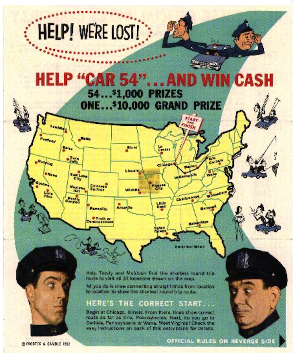

## _Traveling Salesman Problem_

В этом проекте тебе предстоит применить SQL-инструменты для решения классической задачи коммивояжёра (Traveling Salesman Problem). Ты освоишь навыки моделирования графов и маршрутов в SQL, научишься создавать таблицы с узлами и стоимостью перемещений, а также писать запросы для поиска оптимальных путей с минимальными затратами и анализа результатов с сортировкой.

Полученные навыки помогут тебе в дальнейшем решать задачи оптимизации, анализа данных и построения архитектуры информационных систем — востребованные в бизнес-аналитике, разработке программного обеспечения и управлении ИТ-инфраструктурой.

## Chapter I
## Введение

Дано конечное число «городов» и стоимость перемещения между каждой парой городов. Требуется найти самый дешёвый маршрут, позволяющий посетить все города и вернуться в исходную точку.

(На изображении показан конкурс, проведённый компанией Proctor and Gamble в 1962 году. Участникам требовалось решить задачу коммивояжёра для набора из 33 городов. Несколько человек нашли оптимальное решение, и между ними зафиксирована ничья. Одним из победителей стал профессор Джеральд Томпсон из Университета Карнеги-Меллона — один из первых исследователей этой задачи.)

Дан конечный полный граф с целочисленными весами на рёбрах. Требуется найти гамильтонов цикл (то есть цикл, проходящий через все вершины) с минимальным суммарным весом. В данном контексте гамильтоновы циклы также называют турами.

Истоки задачи коммивояжёра (TSP) не до конца ясны. В 1920-х годах математик и экономист Карл Менгер опубликовал её среди своих коллег в Вене. В 1930-х годах эта задача вновь привлекла внимание математиков в Принстоне. В 1940-х годах её изучали статистики (Махаланобис (1940), Йессен (1942), Гош (1948), Маркс (1948)) в контексте сельскохозяйственного применения, а математик Мерилл Флуд популяризировал её среди коллег в корпорации RAND. В конечном счёте, задача коммивояжёра стала известна как прототип сложной задачи комбинаторной оптимизации: исследовать все маршруты по одному невозможно из-за их огромного количества, и долгое время не возникало других идей по эффективному решению.

## Chapter II
## Задание 00 — Classical TSP

| Задание 00: Classical TSP | |
|--------------------------|--|
| Директория для загрузки решений | ex00 |
| Файлы для загрузки | `team00_ex00.sql` DDL for table creation with INSERTs of data; SQL DML statement |
| **Разрешено** | |
| Язык | ANSI SQL |
| Шаблон синтаксиса SQL | Рекурсивный запрос |

Изучите граф. В нём четыре города (a, b, c и d) и дуги между ними с указанием стоимости (или налогов). На самом деле стоимость одинакова в обе стороны, то есть cost(a, b) = cost(b, a).

Создайте таблицу с названными узлами по структуре {point1, point2, cost} и заполни её данными согласно изображению (не забывай, что между двумя узлами есть пути в обоих направлениях).

Напишите SQL-запрос, который вернет все маршруты (также называемые путями) с минимальной суммарной стоимостью путешествия, если стартовать из города «a». Помните, что нужно найти самый дешевый способ посетить все города и вернуться в исходную точку.

Например, маршрут может выглядеть так: a -> b -> c -> d -> a.

Ниже приведен пример вывода данных.

Отсортируйте результат сначала по total_cost, а затем по маршруту (tour).

| total_cost | tour |
|------------|------|
| 80 | {a,b,d,c,a} |
| ... | ... |

## Задание 01 — Opposite TSP

| Задание 01: Opposite TSP | |
|-------------------------|--|
| Директория для загрузки решений | ex01 |
| Файлы для загрузки | `team00_ex01.sql` SQL DML statement |
| **Разрешено** | |
| Язык | ANSI SQL |
| Шаблон синтаксиса SQL | Рекурсивный запрос |

Добавьте возможность вывести дополнительные строки с самой высокой стоимостью к SQL-запросу из предыдущего упражнения.  
Ознакомьтесь с приведенным ниже примером данных.  
Отсортируйте результат сначала по total_cost, а затем по маршруту (tour).

| total_cost | tour |
|------------|------|
| 80 | {a,b,d,c,a} |
| ... | ... |
| 95 | {a,d,c,b,a} |